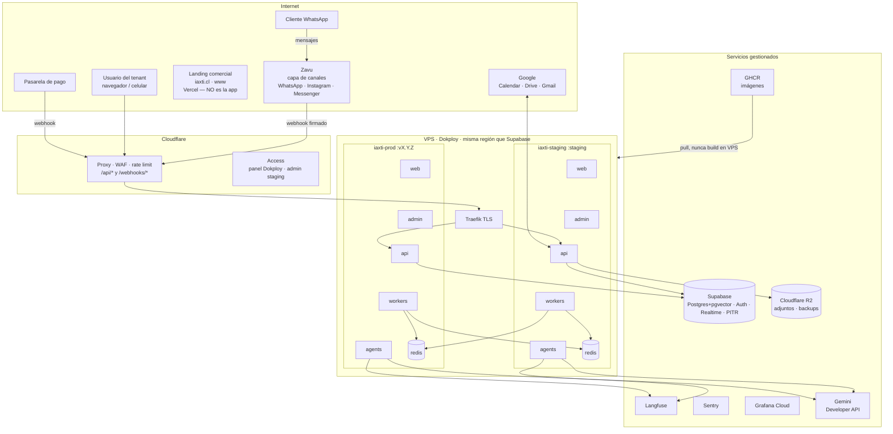
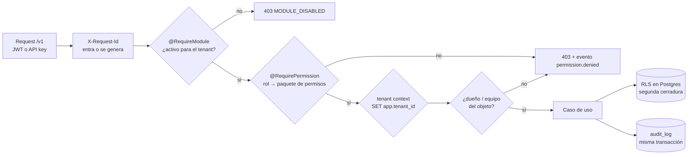
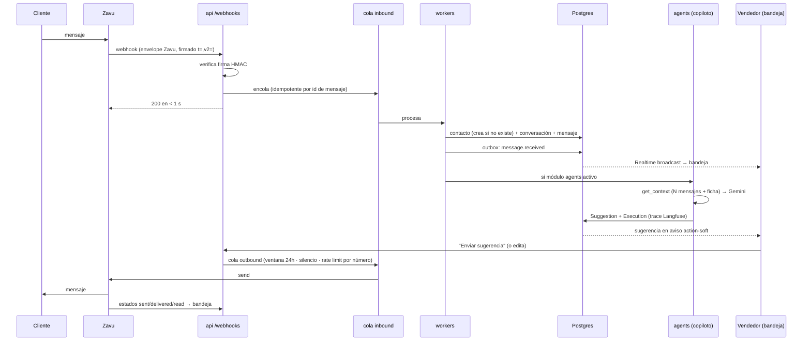
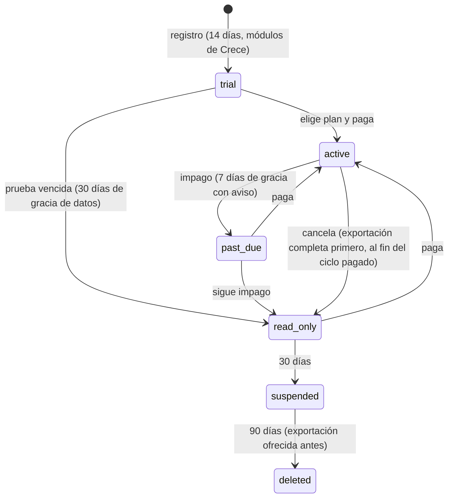

# Arquitectura de IAxTi

Diagramas de referencia. La fuente de verdad es `docs/SPEC.md`; ante conflicto,
manda el SPEC. Cada decisión tiene su ADR en `docs/adr/`.

## 1. Infraestructura (etapa 1: un VPS)



## 2. Sistema de módulos

```mermaid
flowchart TB
  subgraph core[packages/core — no conoce ningún módulo]
    REG[Module Registry<br/>lee module.yaml · grafo · orden topológico<br/>ciclos y colisiones abortan el arranque]
    CAP[capabilities.get&#40;id&#41;<br/>opcional: null degrada]
    BUS[Outbox transaccional<br/>consumidores idempotentes]
  end

  subgraph nucleo[Núcleo — nunca se apaga]
    ID[identity] --- ORG[organizations] --- AUTH[authorization] --- AUD[audit]
  end

  subgraph negocio[Módulos de negocio — interruptor por plataforma y por tenant]
    CRM[crm] --- CONV[conversations] --- CH[channels]
    WA[whatsapp] --- WC[webchat] --- AG[agents]
    KN[knowledge] --- AUTO[automations] --- CAL[calendar]
    PAY[payments] --- INT[integrations] --- AN[analytics]
    BIL[billing] --- NOT[notifications] --- PLAT[platform]
  end

  REG -->|inicializa en orden| nucleo --> negocio
  negocio -->|import solo vía contract.ts<br/>dependency-cruiser lo verifica en CI| negocio
  negocio -->|publica/consume por nombre| BUS
```



Módulo apagado para un tenant: endpoints responden `MODULE_DISABLED`, navegación
y widgets desaparecen (`GET /me/modules`), tools no se registran, jobs se saltan.
Los datos no se tocan.

## 3. Verificación de permisos (toda request, toda tool)



Las tools de los agentes pasan por el mismo guard con la identidad del usuario
que conversa (`on_behalf_of`). Las API keys, con `actor_kind = apikey`.

## 4. Mensaje de WhatsApp de punta a punta



En modo autónomo (opt-in, por horario), el paso del vendedor lo hace el agente
dentro de las reglas de escalamiento; el mensaje queda marcado "respondió el
asistente".

## 5. Flujo del configurador

```mermaid
sequenceDiagram
  participant U as Dueño (onboarding)
  participant CFG as agents (configurador)
  participant API as api (rutas admin)
  participant DB as Postgres

  U->>CFG: cómo vende, qué pasa después, cómo cobra (máx 3 preguntas)
  CFG->>CFG: plantilla de la vertical + Gemini (modelo alto)
  CFG-->>U: diff "antes / después" (pipeline, campos, etiquetas,<br/>respuestas rápidas, 3 automatizaciones, 3 plantillas WA)
  U->>CFG: "Armar mi CRM"
  CFG->>API: mismas APIs de admin, permisos del usuario
  API->>DB: aplica + audit (user via agent)
  API-->>U: CRM armado; todo editable después
```

## 6. Flujo de un pago

```mermaid
sequenceDiagram
  participant V as Vendedor o IA
  participant API as api
  participant PP as Pasarela
  participant C as Cliente
  participant DB as Postgres

  V->>API: crear link (monto de la oportunidad; IA: tope + confirmación)
  API->>PP: crea link
  API->>C: link por la conversación (cola outbound)
  C->>PP: paga
  PP->>API: webhook (verificado, idempotente, encolado)
  API->>DB: Payment + link paid + audit
  API->>DB: mueve oportunidad a etapa de pagado (si configurado)
  DB-->>V: comprobante en la conversación + notificación
```

## 7. Ciclo de vida del tenant



`read_only`: se reciben mensajes, no se envían salvo respuestas manuales. Bajar
de plan nunca borra: los módulos que sobran pasan a solo lectura.
