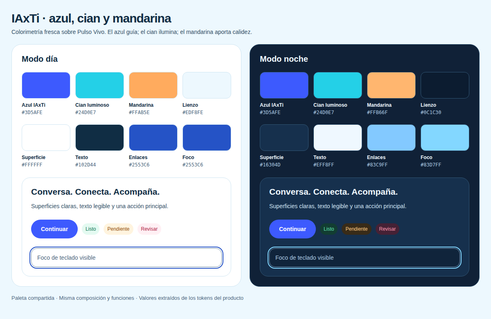

# #408 · paleta fresca de IAxTi

Definición: [`docs/diseno/paleta.md`](../../diseno/paleta.md), ADR-0022.

`before.json` y `after.json`: nueve superficies × día/noche × 1366×768/360×640.
Build standalone real, datos visuales sintéticos, densidad 1 y movimiento
reducido. No hay excepciones JavaScript ni desbordes horizontales. Las alturas
y anchos de documento coinciden; los accesos conservan el ajuste de #406.

Las comparaciones de escritorio presentan capturas de 1366×768 a mitad de
escala, ambos lados por igual. La comparación móvil conserva 360×640 a 1:1.
Los archivos individuales conservan sus píxeles originales.

`contraste.json` contiene 102 pares calculados con luminancia relativa;
`packages/ui/tests/contraste.test.ts` aplica los umbrales sin redondear.
`bandeja-densa-noche-360.png` procede del E2E de densidad del build final.

El informe completo y los límites de la revisión están en `design-qa.md`.
